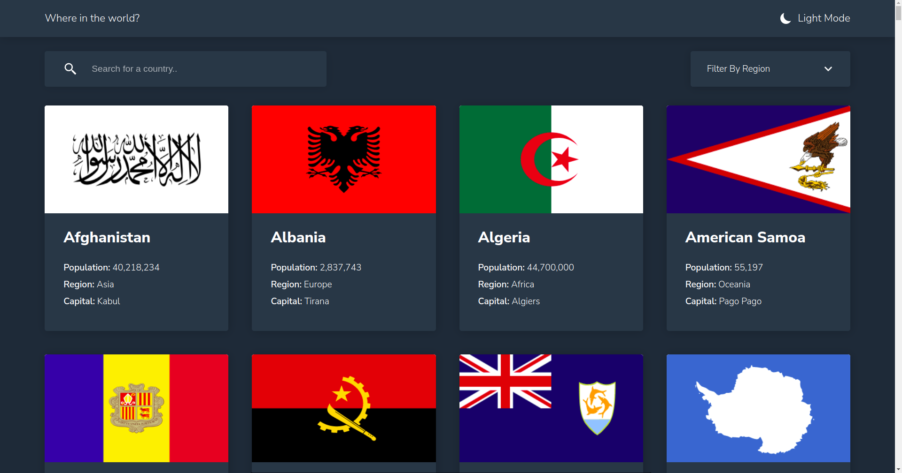

# Frontend Mentor - REST Countries API with color theme switcher solution

This is a solution to the [REST Countries API with color theme switcher challenge on Frontend Mentor](https://www.frontendmentor.io/challenges/rest-countries-api-with-color-theme-switcher-5cacc469fec04111f7b848ca). Frontend Mentor challenges help you improve your coding skills by building realistic projects. 

## Table of contents

- [Overview](#overview)
  - [The challenge](#the-challenge)
  - [Screenshot](#screenshot)
  - [Links](#links)
- [My process](#my-process)
  - [Built with](#built-with)
  - [What I learned](#what-i-learned)
  - [Continued development](#continued-development)
- [Author](#author)

## Overview

### The challenge

Users should be able to:

- See all countries from the API on the homepage
- Search for a country using an `input` field
- Filter countries by region
- Click on a country to see more detailed information on a separate page
- Click through to the border countries on the detail page
- Toggle the color scheme between light and dark mode *(optional)*

### Screenshot



### Links

- Live Site URL: [Where in the world?](https://where-in-the-world-henna.vercel.app/)
- Solution URL: [Rexer-Glitch/REST-countries-API](https://github.com/Rexer-Glitch/REST-countries-API)

## My process

### Built with

- Semantic HTML5 markup
- Flexbox
- CSS Grid
- Mobile-first workflow
- [React](https://reactjs.org/) - JS library
- [React-Helmet](github.com/nfl/react-helmet) - A document head manager for react
- [Styled Components](https://styled-components.com/) - For styles
- [React-detect-offline](https://github.com/cwise89/react-detect-offline) - to detect network connectivity


### What I learned


I learnt network connectivity detection using navigator.onLine and online, offline events, though they have some drawbacks, for example, online event can still fire even when connected to a network without internet access.
```html

console.log('Initially ' + (window.navigator.onLine ? 'on' : 'off') + 'line');

window.addEventListener('online', () => console.log('Became online'));

window.addEventListener('offline', () => console.log('Became offline'));

```

### Continued development

- I would like to focus my attention on loosy search algorithms


## Author

- Website - [Raymac Antony Gumbo](https://www.raymacantony.com)
- Frontend Mentor - [@Rexer-Glitch](https://www.frontendmentor.io/profile/Rexer-Glitch)
- Twitter - [@Raymacantonyg](https://www.twitter.com/Raymacantonyg)

